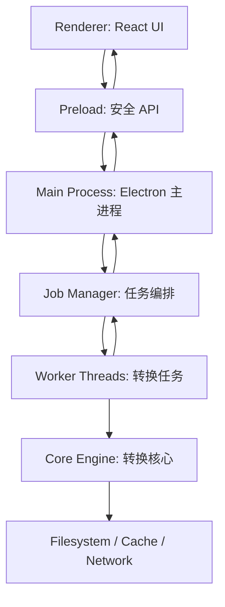
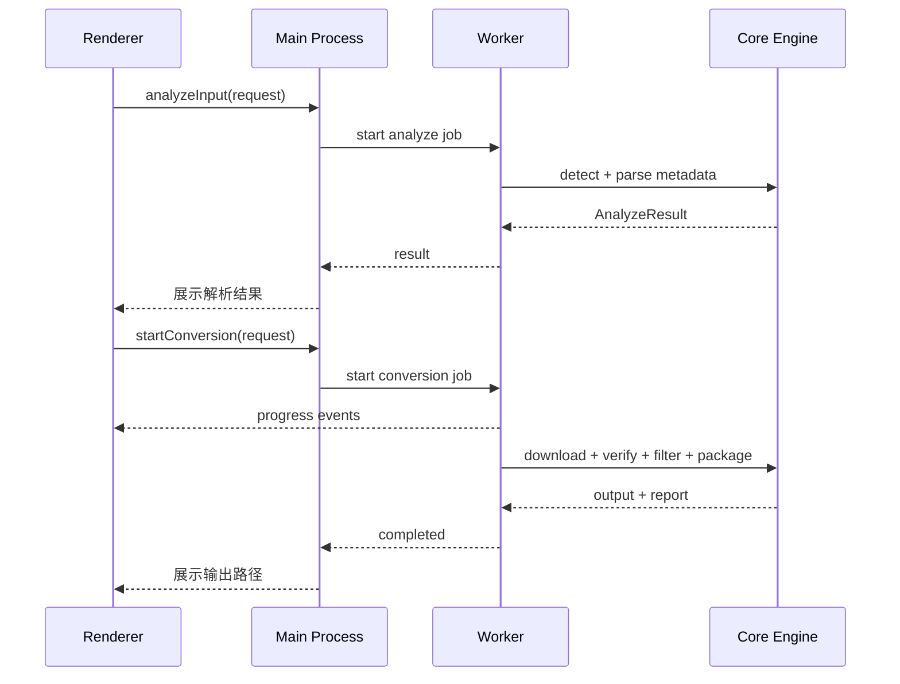

# 我的世界整合包转服务端包工具技术架构文档

版本：v0.1  
状态：草案  
日期：2026-06-30  
技术方向：Electron + TypeScript

## 1. 架构目标

本工具 MVP 采用 Electron 开发 Windows 桌面程序，目标是在不打开终端的情况下完成整合包导入、解析、规则化 Mod 筛选、转换、打包和报告查看。

架构设计目标：

- 桌面端体验优先，支持拖拽导入、进度展示、日志查看、失败诊断。
- 核心转换逻辑与 UI 解耦，后续可复用到 CLI 或 Web 后端。
- 大文件下载、解压、哈希、打包等耗时任务不得阻塞 UI。
- 严格隔离渲染进程和本地系统能力，降低 Electron 安全风险。
- Windows MVP 可稳定打包为安装包和免安装包。

## 2. 技术选型

| 层级 | 技术 | 说明 |
| --- | --- | --- |
| 桌面框架 | Electron | 跨平台桌面壳，MVP 先支持 Windows 10/11。 |
| 语言 | TypeScript | 主进程、预加载脚本、渲染进程和核心引擎统一使用 TS。 |
| 前端框架 | React | 适合构建任务向导、表格、日志面板、设置页。 |
| 构建工具 | Vite | 开发启动快，适合 Electron renderer。 |
| 后台任务 | Node.js Worker Threads | 下载、解压、哈希、JAR 扫描和打包放入 Worker。 |
| 打包工具 | electron-builder | 输出 Windows NSIS 安装包和 portable 免安装包。 |
| 日志 | electron-log 或 pino | 主进程和 Worker 写诊断日志，UI 展示摘要。 |
| 数据校验 | zod | 校验 IPC 参数、配置文件、规则库文件、报告结构。 |
| JSON | 原生 JSON / zod schema | 解析 Modrinth、报告、配置。 |
| TOML | smol-toml 或 @iarna/toml | 解析 packwiz、Forge/NeoForge 元数据。 |
| 压缩包 | yauzl + yazl 或 adm-zip | 安全读取 zip/mrpack，输出服务端 zip。 |
| 下载 | undici | 并发下载、超时、重试、流式写入。 |
| 哈希 | Node crypto | sha1、sha256、sha512 等校验。 |

## 3. 总体架构



核心原则：

- Renderer 只负责界面状态和用户交互，不直接访问 `fs`、`child_process`、`shell` 等 Node API。
- Preload 只暴露白名单 API，例如选择文件、启动任务、订阅进度、取消任务、打开输出目录。
- Main Process 管理窗口、菜单、系统对话框、IPC、任务生命周期和安全边界。
- Worker Threads 执行转换任务，避免 CPU/IO 密集操作卡住主进程或 UI。
- Core Engine 是纯业务模块，不依赖 Electron，后续可被 CLI 复用。

## 4. 进程模型

### 4.1 Renderer

职责：

- 首页/任务创建。
- 转换配置表单。
- 解析结果展示。
- 规则配置、转换进度、日志摘要、错误提示。
- 转换进度、日志摘要、错误提示。
- 结果页和设置页。

限制：

- 不启用 Node 集成。
- 不直接读取本地文件。
- 不拼接任意 shell 命令。
- 只通过 preload 暴露的 API 与本地能力交互。

推荐窗口配置：

```ts
new BrowserWindow({
  webPreferences: {
    preload: path.join(__dirname, "preload.js"),
    nodeIntegration: false,
    contextIsolation: true,
    sandbox: true
  }
});
```

### 4.2 Preload

职责：

- 使用 `contextBridge` 暴露安全 API。
- 包装 `ipcRenderer.invoke` 和事件订阅。
- 不暴露原始 `ipcRenderer`、`fs`、`path`、`process` 给 Renderer。

示例 API 形态：

```ts
window.serverpack = {
  selectInput: () => Promise<InputSelection>,
  selectOutputDir: () => Promise<string | null>,
  analyzeInput: (request: AnalyzeRequest) => Promise<AnalyzeResult>,
  startConversion: (request: ConversionRequest) => Promise<JobId>,
  cancelJob: (jobId: string) => Promise<void>,
  onJobEvent: (jobId: string, handler: (event: JobEvent) => void) => Unsubscribe,
  openPath: (path: string) => Promise<OpenPathResult>
};
```

### 4.3 Main Process

职责：

- 创建窗口和应用菜单。
- 打开文件/目录选择器。
- 校验来自 Renderer 的 IPC 请求。
- 创建、取消、清理转换任务。
- 管理 Worker 生命周期。
- 记录主进程日志。
- 调用系统能力，例如打开输出目录。

Main Process 不做重型转换逻辑，只做任务调度和边界控制。

### 4.4 Worker Threads

职责：

- 解析整合包。
- 下载文件。
- 校验哈希。
- 解压和复制 overrides。
- 扫描 JAR 元数据。
- 执行 Mod 筛选规则。
- 生成服务端目录、zip、README、报告。

Worker 必须支持：

- 进度事件。
- 分阶段日志。
- 可取消任务。
- 失败报告落盘。
- 临时目录清理。

## 5. 模块划分

建议使用单仓库多模块结构：

```text
.
  apps/
    desktop/
      src/
        main/
        preload/
        renderer/
        workers/
      electron-builder.yml
      package.json
  packages/
    core/
      src/
        parsers/
        download/
        archive/
        mod-analysis/
        rules/
        serverpack/
        report/
        security/
    shared/
      src/
        ipc/
        schemas/
        types/
        errors/
  docs/
    requirements.md
    architecture.md
```

模块职责：

| 模块 | 职责 |
| --- | --- |
| `apps/desktop/main` | Electron 主进程、窗口、IPC handler、任务管理。 |
| `apps/desktop/preload` | 安全桥接 API。 |
| `apps/desktop/renderer` | React UI。 |
| `apps/desktop/workers` | Worker 入口，调用 core。 |
| `packages/core/parsers` | CurseForge、Modrinth、packwiz 输入解析。 |
| `packages/core/download` | 下载、重试、限速、缓存、哈希校验。 |
| `packages/core/archive` | 安全解压、zip 输出、路径穿越防护。 |
| `packages/core/mod-analysis` | JAR 元数据读取、client-only 判断。 |
| `packages/core/rules` | 内置规则和远程规则库合并。 |
| `packages/core/serverpack` | 服务端目录生成、启动脚本、README。 |
| `packages/core/report` | JSON/Markdown 报告生成。 |
| `packages/shared` | 类型、错误码、IPC schema、通用工具。 |

## 6. 核心转换流程



转换阶段：

1. 输入识别：判断 `.mrpack`、CurseForge `.zip`、packwiz 目录。
2. 元数据提取：获取名称、版本、Minecraft 版本、加载器类型和版本。
3. 安全预检：文件数量、展开大小、路径穿越、协议白名单。
4. 文件清单解析：生成统一的 `ModFileDescriptor[]`。
5. 下载与缓存：并发下载，流式写入临时文件。
6. 哈希校验：sha1/sha512 等。
7. JAR 扫描：读取 `fabric.mod.json`、`quilt.mod.json`、`mods.toml`、`neoforge.mods.toml`、`mcmod.info`。
8. Mod 决策：远程规则库、平台 env 和 JAR 元数据合并。
9. overrides 合并：处理 `overrides/`、`server-overrides/`，排除客户端文件。
10. 服务端包生成：输出 `mods/`、`config/`、启动脚本、README。
11. 报告生成：输出 `conversion-report.json` 和可选 Markdown。
12. zip 打包：生成最终服务端包。

## 7. IPC 设计

IPC 必须显式声明 channel，所有请求和响应都使用 zod schema 校验。

推荐 channel：

| Channel | 方向 | 用途 |
| --- | --- | --- |
| `dialog:select-input` | Renderer -> Main | 选择整合包文件或目录。 |
| `dialog:select-output-dir` | Renderer -> Main | 选择输出目录。 |
| `job:analyze` | Renderer -> Main | 解析输入，返回元数据和初步清单。 |
| `job:start` | Renderer -> Main | 启动转换任务。 |
| `job:cancel` | Renderer -> Main | 取消任务。 |
| `job:event` | Main -> Renderer | 推送进度、日志、错误、完成事件。 |
| `settings:get` | Renderer -> Main | 读取设置。 |
| `settings:update` | Renderer -> Main | 更新设置。 |
| `path:open` | Renderer -> Main | 打开输出目录或报告。 |

事件类型：

```ts
type JobEvent =
  | { type: "phase"; jobId: string; phase: ConversionPhase; message: string }
  | { type: "progress"; jobId: string; current: number; total: number; bytesPerSecond?: number }
  | { type: "log"; jobId: string; level: "debug" | "info" | "warn" | "error"; message: string }
  | { type: "completed"; jobId: string; outputDir: string; zipPath?: string; reportPath: string }
  | { type: "failed"; jobId: string; error: AppError; reportPath?: string }
  | { type: "cancelled"; jobId: string };
```

## 8. 数据模型

核心模型保持平台无关。

```ts
type PackType = "curseforge" | "modrinth" | "packwiz" | "instance";
type LoaderType = "forge" | "neoforge" | "fabric" | "quilt" | "vanilla";
type ModDecisionValue = "include" | "exclude";

interface PackMetadata {
  type: PackType;
  name: string;
  version?: string;
  minecraftVersion?: string;
  loader?: LoaderType;
  loaderVersion?: string;
}

interface ModFileDescriptor {
  id?: string;
  name?: string;
  fileName: string;
  source: "curseforge" | "modrinth" | "direct" | "local";
  downloadUrls: string[];
  expectedHashes: Record<string, string>;
  pathInPack?: string;
  env?: {
    client?: "required" | "optional" | "unsupported";
    server?: "required" | "optional" | "unsupported";
  };
}

interface ModDecision {
  fileName: string;
  decision: ModDecisionValue;
  reason: string;
  source: "manifest" | "jar-metadata" | "builtin-rule" | "user-rule" | "unknown";
}
```

## 9. UI 架构

推荐页面：

| 页面 | 功能 |
| --- | --- |
| `TaskCreatePage` | 拖拽/选择输入、选择输出目录。 |
| `AnalyzePage` | 展示解析结果和缺失元数据补全表单。 |
| `ConfigPage` | 输出模式、zip、优化启动脚本、Java Home、API key、缓存目录。 |
| `ProgressPage` | 阶段进度、下载速度、日志摘要、取消任务。 |
| `ResultPage` | 输出路径、报告、README、失败建议。 |
| `SettingsPage` | 默认配置、安全限制、日志级别、缓存清理。 |

状态管理：

- 简单 MVP 可使用 Zustand。
- 表单使用 React Hook Form + zod resolver。
- 对列表型设置保留可扩展组件边界，但 MVP 不提供只读 Mod 预览或人工决策表格。

## 10. 本地存储

推荐目录：

```text
%APPDATA%/MinecraftServerpackTool/
  config.json
  logs/
  cache/
    downloads/
    metadata/
  jobs/
    {jobId}/
      work/
      conversion-report.json
```

存储策略：

- `config.json` 保存非敏感设置。
- API key 优先保存到系统凭据存储；MVP 如暂用配置文件，必须加密或提示风险，并禁止写入日志/报告。
- 下载缓存按哈希命名，避免同名文件冲突。
- 临时任务目录位于 `jobs/{jobId}/work`，成功后清理，失败时保留必要报告和日志。

## 11. 下载与缓存

下载器要求：

- 使用 HTTPS，除非用户显式允许不安全来源。
- 默认并发数 4，可配置。
- 支持超时、重试、断点续传可作为 P1。
- 流式写入临时文件，完成后哈希校验，再移动到缓存。
- 缓存 key 使用 `source + fileId + hash` 或 `hash`。
- CurseForge API key 通过主进程注入，不传给 Renderer 日志面板。

## 12. 压缩包安全

必须防护：

- `../` 路径穿越。
- 绝对路径。
- Windows 盘符路径，例如 `C:\...`。
- UNC 路径，例如 `\\server\share`。
- zip bomb：限制展开总大小、文件数、单文件大小。
- 符号链接逃逸：MVP 可拒绝压缩包内 symlink。

所有解压目标路径必须经过：

```text
normalize -> resolve -> startsWith(expectedRoot)
```

校验失败时返回 `E_ARCHIVE_UNSAFE_PATH` 或 `E_ARCHIVE_LIMIT_EXCEEDED`。

## 13. 服务端包生成

输出目录：

```text
serverpack/
  mods/
  config/
  defaultconfigs/
  kubejs/
  scripts/
  libraries/
  start.bat
  start.sh
  README.md
  conversion-report.json
```

生成策略：

- `mods/` 只放 `include` 的 Mod。
- 未知 Mod 默认保留，避免静默删除服务端依赖；已知客户端 Mod 由规则排除。
- `overrides/` 先合并，`server-overrides/` 后合并。
- 默认排除客户端专用文件。
- `eula.txt` 不自动设置为 `eula=true`。
- 启动脚本不硬编码开发者机器路径。

## 14. 错误码

错误模型：

```ts
interface AppError {
  code: string;
  message: string;
  detail?: unknown;
  suggestion?: string;
  recoverable: boolean;
}
```

核心错误码：

| 错误码 | 含义 |
| --- | --- |
| `E_INPUT_NOT_FOUND` | 输入文件或目录不存在。 |
| `E_INPUT_FORMAT` | 无法识别整合包格式。 |
| `E_ARCHIVE_UNSAFE_PATH` | 压缩包包含不安全路径。 |
| `E_ARCHIVE_LIMIT_EXCEEDED` | 压缩包超过安全限制。 |
| `E_METADATA_MISSING` | 缺少 Minecraft 或加载器元数据。 |
| `E_CURSEFORGE_API_KEY_REQUIRED` | CurseForge 下载需要 API key。 |
| `E_DOWNLOAD_FAILED` | 下载失败。 |
| `E_DOWNLOAD_HASH_MISMATCH` | 哈希校验失败。 |
| `E_LOADER_UNSUPPORTED` | 加载器或版本暂不支持。 |
| `E_OUTPUT_WRITE_FAILED` | 输出目录写入失败。 |
| `E_JOB_CANCELLED` | 任务被用户取消。 |

## 15. 安全设计

Electron 安全基线：

- `nodeIntegration: false`。
- `contextIsolation: true`。
- `sandbox: true`。
- 不加载远程页面。
- 使用 CSP 禁止不必要的脚本来源。
- Renderer 不能直接访问 Node API。
- Preload 只暴露最小 API。
- IPC 参数必须 schema 校验。
- `shell.openPath` 只允许打开本应用生成或用户选择的路径。
- 不执行整合包内脚本、JAR、bat、sh 或任意可执行文件。
- 不把 API key 写入日志、报告、崩溃转储或 UI 明文区域。

## 16. 打包发布

MVP 发布目标：

- Windows x64 NSIS 安装包。
- Windows x64 portable 免安装包。

`electron-builder` 配置建议：

```yaml
appId: com.example.minecraft-serverpack-tool
productName: Minecraft Serverpack Tool
directories:
  output: release
files:
  - dist/**
  - package.json
win:
  target:
    - target: nsis
      arch:
        - x64
    - target: portable
      arch:
        - x64
artifactName: "${productName}-${version}-${arch}.${ext}"
```

发布注意事项：

- MVP 可以先不做代码签名，但需预期 Windows SmartScreen 提示。
- P1 再考虑自动更新和代码签名。
- 不把开发环境、测试样本、缓存目录打入安装包。
- portable 版本要处理用户数据目录，不能写到程序安装目录。

## 17. 测试策略

### 17.1 单元测试

- manifest 解析。
- TOML 解析。
- 路径安全校验。
- 下载 URL 校验。
- 哈希校验。
- Mod 决策合并。
- overrides 合并优先级。
- 报告 schema。

推荐工具：Vitest。

### 17.2 集成测试

- `.mrpack` 转换。
- CurseForge `.zip` 转换。
- packwiz 目录转换。
- 模拟 CurseForge API key 缺失。
- 模拟下载失败。
- 模拟哈希不匹配。
- 模拟路径穿越压缩包。

### 17.3 Electron 端到端测试

- 启动桌面程序。
- 拖拽导入。
- 选择输出目录。
- 展示解析结果。
- 远程规则库命中和优先级。
- 转换中取消任务。
- 成功后打开输出目录和报告。
- 失败后展示错误码和建议。

推荐工具：Playwright for Electron 或 WebdriverIO。

## 18. 开发命令草案

```bash
pnpm install
pnpm dev
pnpm test
pnpm lint
pnpm typecheck
pnpm build
pnpm dist:win
```

## 19. 里程碑

### A1：项目骨架

- 初始化 Electron + React + TypeScript + Vite。
- 配置主进程、preload、renderer。
- 配置安全窗口参数。
- 建立 shared schema 和 IPC 基础。

### A2：核心解析

- 实现 CurseForge、Modrinth、packwiz 解析。
- 实现分析任务 Worker。
- UI 展示解析结果和缺失元数据补全。

### A3：转换引擎

- 实现下载、缓存、哈希。
- 实现 JAR 元数据扫描。
- 实现 Mod 决策和远程规则库。
- 实现 overrides 合并。

### A4：服务端包输出

- 生成服务端目录、README、启动脚本、报告。
- 生成 zip。
- UI 展示结果页。

### A5：桌面体验和发布

- 完成设置页、日志面板、失败诊断页。
- 完成取消任务和临时目录清理。
- 完成 Windows 安装包和 portable 包。
- 完成 MVP 测试样本。

## 20. 主要风险与应对

| 风险 | 应对 |
| --- | --- |
| Electron 包体和内存较大 | MVP 接受，优先换取开发效率；P1 再优化。 |
| Renderer 安全边界设计不当 | 严格使用 preload 白名单和 IPC schema 校验。 |
| 大文件操作卡 UI | 所有重型任务进入 Worker Threads。 |
| Node zip 库路径安全差异 | 自建统一安全路径校验，不依赖库默认行为。 |
| CurseForge 下载限制 | 明确 API key 配置和可诊断失败。 |
| Mod 侧别判断不准 | 远程规则库和报告提示兜底。 |
| Windows 杀毒或 SmartScreen 提示 | P1 引入代码签名；MVP 文档中说明。 |

## 21. 参考资料

- Electron 安全文档：推荐使用 preload、`contextIsolation`，避免把 Node API 直接暴露给 Renderer。<https://www.electronjs.org/docs/latest/tutorial/security>
- Electron 进程模型：主进程、渲染进程和 preload 脚本职责边界。<https://www.electronjs.org/docs/latest/tutorial/process-model>
- Electron IPC：Renderer 与 Main Process 通过 IPC 调用本地能力。<https://www.electronjs.org/docs/latest/tutorial/ipc>
- electron-builder Windows 打包：支持 NSIS 和 portable 输出目标。<https://www.electron.build/>
