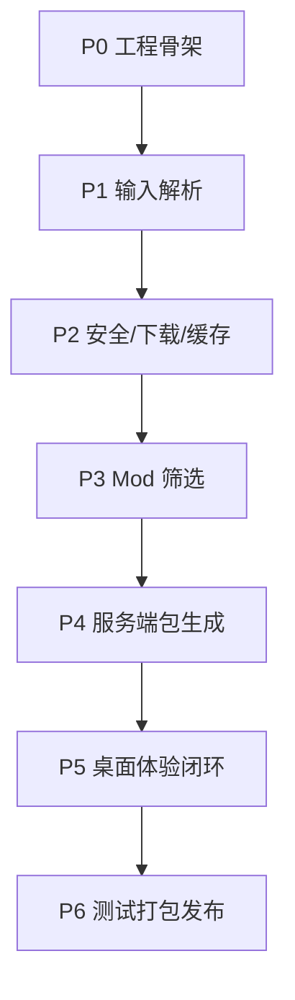

# 我的世界整合包转服务端包工具开发计划文档

版本：v0.1  
状态：草案  
日期：2026-06-30  
依据文档：

- `docs/requirements.md` v0.2
- `docs/architecture.md` v0.1

## 1. 计划目标

本开发计划用于把需求文档和技术架构文档拆分为可执行、可验收、可排期的开发任务。

MVP 目标：

- 交付 Windows 10/11 桌面程序。
- 使用 Electron + TypeScript + React + Node Worker Threads。
- 支持 CurseForge `.zip`、Modrinth `.mrpack`、packwiz 目录输入。
- 完成整合包解析、下载、哈希校验、Mod 服务端筛选、人工复核、overrides 合并、服务端包输出和报告生成。
- 输出目录和 `.zip` 服务端包。
- 支持 Windows 安装包和 portable 免安装包。

## 2. 排期假设

本计划不绑定具体日期，按阶段推进。若 1 名全栈开发者独立完成，建议按 6 到 8 周规划；若 2 到 3 名开发者并行，建议按 4 到 6 周规划。

角色假设：

- 桌面端开发：Electron、React、UI 状态、端到端测试。
- 核心引擎开发：解析、下载、哈希、规则、服务端包生成。
- 测试/发布：样本包、回归测试、Windows 打包、发布检查。

## 3. 阶段总览

| 阶段 | 名称 | 目标 | 主要交付物 |
| --- | --- | --- | --- |
| P0 | 工程骨架 | 建立可运行、可测试、可打包的基础项目。 | Electron 项目、monorepo、基础 IPC、CI 脚本。 |
| P1 | 核心模型与输入解析 | 统一三类整合包输入，生成分析结果。 | parser、schema、AnalyzeResult、解析 UI。 |
| P2 | 安全、下载与缓存 | 建立安全文件处理和可恢复下载能力。 | 安全解压、下载器、缓存、哈希校验。 |
| P3 | Mod 筛选与人工复核 | 判断 Mod 服务端兼容性并支持人工决策。 | JAR 扫描、规则引擎、ReviewPage。 |
| P4 | 服务端包生成 | 生成可交付的服务端目录、zip 和报告。 | serverpack、README、启动脚本、报告。 |
| P5 | 桌面体验闭环 | 完成任务向导、进度、日志、设置、失败诊断。 | 完整桌面 MVP 流程。 |
| P6 | 测试、打包与发布 | 完成回归测试和 Windows 发布物。 | NSIS 安装包、portable 包、发布检查清单。 |

## 4. 开发原则

- 核心转换逻辑必须位于 `packages/core`，不能写死在 React 组件或 Electron 主进程中。
- Renderer 不直接访问 Node API，所有本地能力通过 preload 白名单 API 调用。
- 所有 IPC 请求和响应必须经过 zod schema 校验。
- 下载、解压、哈希、JAR 扫描、zip 打包必须在 Worker Threads 中执行。
- 所有文件写入先进入任务临时目录，成功后再输出最终目录或 zip。
- 转换失败也要尽可能生成失败报告。
- API key 不得出现在日志、报告、UI 明文区域或输出包中。

## 5. 阶段任务拆分

### P0：工程骨架

目标：建立开发基础，保证桌面程序可以启动、类型检查、测试和打包。

| ID | 任务 | 交付物 | 依赖 | 验收标准 |
| --- | --- | --- | --- | --- |
| P0-01 | 初始化 monorepo | `apps/desktop`、`packages/core`、`packages/shared` | 无 | `pnpm install` 可完成依赖安装。 |
| P0-02 | 初始化 Electron + React + Vite | 主进程、preload、renderer 基础结构 | P0-01 | `pnpm dev` 可启动桌面窗口。 |
| P0-03 | 配置 TypeScript、ESLint、Prettier | 基础工程质量配置 | P0-01 | `pnpm typecheck`、`pnpm lint` 可运行。 |
| P0-04 | 建立 shared schema 和错误模型 | `AppError`、`JobEvent`、基础 zod schema | P0-01 | schema 有单元测试。 |
| P0-05 | 建立 IPC 基础 | `dialog:select-input`、`dialog:select-output-dir` 示例 | P0-02、P0-04 | Renderer 可通过安全 API 调用系统文件选择器。 |
| P0-06 | 建立 Worker 任务框架 | Worker 创建、事件回传、取消信号 | P0-04 | 示例任务可推送进度并被取消。 |
| P0-07 | 配置 electron-builder | Windows NSIS 和 portable 配置草案 | P0-02 | `pnpm dist:win` 至少能产出测试构建。 |

阶段出口：

- 桌面窗口能启动。
- Renderer、preload、main、worker 分层成立。
- 基础 IPC、安全窗口参数和任务事件链路可用。

### P1：核心模型与输入解析

目标：实现三类整合包识别和元数据提取，桌面端能展示解析结果。

| ID | 任务 | 交付物 | 依赖 | 验收标准 |
| --- | --- | --- | --- | --- |
| P1-01 | 定义核心数据模型 | `PackMetadata`、`ModFileDescriptor`、`AnalyzeResult` | P0-04 | 类型与 `conversion-report.json` 结构兼容。 |
| P1-02 | 输入格式识别 | `.mrpack`、CurseForge `.zip`、packwiz 目录 | P1-01 | 合法样本可识别，未知输入返回 `E_INPUT_FORMAT`。 |
| P1-03 | Modrinth 解析 | `modrinth.index.json`、`overrides`、`server-overrides` | P1-02 | 可提取 dependencies、files、hash、env。 |
| P1-04 | CurseForge 解析 | `manifest.json`、`overrides` | P1-02 | 可提取 Minecraft 版本、modLoader、files。 |
| P1-05 | packwiz 解析 | `pack.toml`、`index.toml`、metafile | P1-02 | 可提取版本、索引文件和 hash 信息。 |
| P1-06 | Analyze Worker | 在 Worker 中执行输入识别和解析 | P0-06、P1-02 | `job:analyze` 返回统一 AnalyzeResult。 |
| P1-07 | 解析结果 UI | `TaskCreatePage`、`AnalyzePage` | P0-05、P1-06 | 用户选择/拖拽输入后可看到包名、版本、加载器、Mod 数量。 |
| P1-08 | 元数据补全表单 | 缺失 Minecraft/loader 信息时允许用户补全 | P1-07 | 缺失字段不会阻塞在不可理解错误上。 |

阶段出口：

- 三类 MVP 输入格式可以解析。
- 桌面端完成导入、分析、展示和缺失信息补全。
- 解析失败有错误码和建议。

### P2：安全、下载与缓存

目标：建立可靠的文件系统和网络基础能力。

| ID | 任务 | 交付物 | 依赖 | 验收标准 |
| --- | --- | --- | --- | --- |
| P2-01 | 安全路径校验 | normalize/resolve/root containment 工具 | P0-04 | `../`、绝对路径、盘符路径、UNC 路径被拒绝。 |
| P2-02 | 压缩包扫描 | 文件数、展开大小、单文件大小限制 | P2-01 | 恶意 zip 样本返回 `E_ARCHIVE_LIMIT_EXCEEDED`。 |
| P2-03 | 安全解压 | `.zip`、`.mrpack` 安全读取和按需解压 | P2-01、P2-02 | 解压不会写出任务目录外。 |
| P2-04 | 下载器 | HTTPS 下载、超时、重试、并发限制 | P1-01 | 下载事件能上报进度和速度。 |
| P2-05 | 缓存管理 | `cache/downloads`、hash 命名、命中复用 | P2-04 | 第二次转换相同文件可命中缓存。 |
| P2-06 | 哈希校验 | sha1、sha256、sha512 | P2-04 | 哈希不匹配返回 `E_DOWNLOAD_HASH_MISMATCH`。 |
| P2-07 | CurseForge API 下载 | API key 配置、下载 URL 获取 | P2-04 | API key 缺失时返回 `E_CURSEFORGE_API_KEY_REQUIRED`。 |
| P2-08 | 下载进度 UI | `ProgressPage` 基础下载进度 | P0-06、P2-04 | 用户能看到阶段、数量、速度、失败重试。 |

阶段出口：

- 所有外部文件下载和本地解压都经过安全校验。
- 下载失败、哈希失败、API key 缺失都有可诊断错误。
- UI 能展示下载阶段进度。

### P3：Mod 筛选与人工复核

目标：实现服务端 Mod 决策，并把不确定项交给用户复核。

| ID | 任务 | 交付物 | 依赖 | 验收标准 |
| --- | --- | --- | --- | --- |
| P3-01 | JAR 元数据读取 | 读取 jar 内 JSON/TOML/INFO 文件 | P2-03 | 可读取 `fabric.mod.json`、`quilt.mod.json`、`mods.toml`。 |
| P3-02 | Fabric/Quilt 环境判断 | env 字段映射到 Mod 决策 | P3-01 | `server=unsupported` 默认排除。 |
| P3-03 | Forge/NeoForge 元数据判断 | `mods.toml`、`neoforge.mods.toml`、`mcmod.info` | P3-01 | 可提取 modId、displayName、版本等基础信息。 |
| P3-04 | 内置 client-only 规则 | 内置排除/包含规则表 | P3-01 | 典型 client-only Mod 能默认排除。 |
| P3-05 | 用户规则文件 | YAML/JSON include/exclude 规则 | P1-01 | 用户规则优先级高于内置规则。 |
| P3-06 | 决策合并器 | manifest env、JAR 元数据、内置规则、用户规则合并 | P3-02、P3-03、P3-04、P3-05 | 每个 Mod 都有 `include/exclude/manual-review` 和 reason。 |
| P3-07 | ReviewPage | manual-review 表格、搜索、筛选、批量决策 | P3-06 | 未处理 manual-review 时不能继续最终转换。 |
| P3-08 | 复核决策写入报告 | 用户决策来源记录 | P3-07 | 报告能看到人工包含/排除依据。 |

阶段出口：

- Mod 服务端筛选链路完成。
- 未知 Mod 不会被静默删除。
- 用户可以在桌面端完成人工复核。

### P4：服务端包生成

目标：生成服务端目录、启动脚本、报告和 zip。

| ID | 任务 | 交付物 | 依赖 | 验收标准 |
| --- | --- | --- | --- | --- |
| P4-01 | 输出目录管理 | 临时目录、最终目录、清理策略 | P2-03 | 取消或失败不会留下半成品最终包。 |
| P4-02 | mods 输出 | 复制 include Mod 到 `mods/` | P3-06 | exclude/manual-review 未处理项不进入最终 `mods/`。 |
| P4-03 | overrides 合并 | CurseForge/Modrinth/packwiz 文件合并 | P2-03、P3-05 | `server-overrides` 覆盖 `overrides`。 |
| P4-04 | 客户端文件排除 | `options.txt`、`shaderpacks/` 等默认排除 | P4-03 | 客户端专用文件不进入服务端包。 |
| P4-05 | 启动脚本生成 | `start.bat`、`start.sh` | P1-01 | 脚本包含内存参数、nogui，不硬编码本机路径。 |
| P4-06 | README 生成 | 服务端部署说明 | P4-05 | 包含 EULA、Java 版本、内存调整、启动方式说明。 |
| P4-07 | 报告生成 | `conversion-report.json`、可选 Markdown | P1-01、P3-08 | 成功/失败都尽量保留报告。 |
| P4-08 | zip 打包 | 输出服务端 `.zip` | P4-01 至 P4-07 | zip 内目录结构正确，可解压使用。 |

阶段出口：

- 可生成完整服务端目录和 zip。
- 报告记录输入、下载、筛选、overrides、错误和警告。
- EULA 不被自动设置为 true。

### P5：桌面体验闭环

目标：把核心能力串成可用的桌面产品流程。

| ID | 任务 | 交付物 | 依赖 | 验收标准 |
| --- | --- | --- | --- | --- |
| P5-01 | 完整任务向导 | 创建、分析、配置、复核、进度、结果 | P1-P4 | 用户不打开终端即可完成转换。 |
| P5-02 | 配置页 | 默认输出目录、缓存、并发数、日志级别 | P2-05 | 配置保存后重启仍生效。 |
| P5-03 | API key 管理 | 输入、遮蔽、清除、脱敏传递 | P2-07 | API key 不出现在日志和报告中。 |
| P5-04 | 日志面板 | 主进程/Worker 日志摘要和导出 | P0-06、P2-08 | 失败时可导出诊断日志。 |
| P5-05 | 失败诊断页 | 错误码、建议、报告入口 | P4-07 | 常见错误有明确下一步建议。 |
| P5-06 | 打开路径能力 | 打开输出目录、报告、README | P0-05、P4-07 | 只允许打开用户选择或应用生成路径。 |
| P5-07 | 取消任务 | 取消下载/解压/打包，清理临时目录 | P0-06、P4-01 | 取消后 UI 进入 cancelled 状态，无半成品输出。 |
| P5-08 | 基础视觉与响应式布局 | 桌面窗口布局、表格、按钮、空态、错误态 | P5-01 | 主要页面在常见窗口尺寸下无文字遮挡。 |

阶段出口：

- MVP 桌面流程完整闭环。
- 成功、失败、取消三种结果都能正确展示。
- 设置、日志、报告、打开目录等基础体验可用。

### P6：测试、打包与发布

目标：完成 MVP 验收，生成可分发 Windows 包。

| ID | 任务 | 交付物 | 依赖 | 验收标准 |
| --- | --- | --- | --- | --- |
| P6-01 | 单元测试补齐 | parser、安全路径、hash、规则、报告测试 | P1-P4 | 核心模块有自动化测试。 |
| P6-02 | 集成测试样本 | 小型 `.mrpack`、CurseForge、packwiz 样本 | P1-P4 | 三类输入可跑通转换。 |
| P6-03 | 恶意样本测试 | 路径穿越、超大展开、hash mismatch | P2 | 安全失败符合预期且不污染输出目录。 |
| P6-04 | Electron E2E | Playwright/WebdriverIO 用例 | P5 | 可覆盖导入、复核、取消、成功、失败流程。 |
| P6-05 | Windows 打包 | NSIS 安装包、portable 包 | P0-07、P5 | 产物可在干净 Windows 环境启动。 |
| P6-06 | 发布检查 | 版本号、许可证、依赖、样本、文档 | P6-05 | 发布包不包含缓存、测试样本和敏感配置。 |
| P6-07 | MVP 验收报告 | 验收结果、已知问题、后续计划 | P6-01 至 P6-06 | 明确是否满足 MVP 发布条件。 |

阶段出口：

- Windows 安装包和 portable 包可交付。
- 自动化测试和人工冒烟测试通过。
- 已知风险和暂缓项记录清楚。

## 6. 任务依赖关系

关键路径：

可并行工作：

- P1 解析器和 P0 UI 壳可以在 schema 稳定后并行。
- P2 下载器和 P3 内置规则库可以并行。
- P4 README/启动脚本模板可以提前开发。
- P5 UI 页面可先用 mock 数据开发，待 Worker 接入后替换。
- P6 测试样本准备可以从 P1 开始同步推进。

## 7. 需求覆盖矩阵

| 需求 | 覆盖任务 |
| --- | --- |
| FR-001 输入解析 | P1-02、P2-01、P2-02、P2-03 |
| FR-002 元数据提取 | P1-03、P1-04、P1-05、P1-08 |
| FR-003 文件解析与下载 | P1-03 至 P1-05、P2-04 至 P2-07 |
| FR-004 服务端 Mod 筛选 | P3-01 至 P3-08 |
| FR-005 overrides 合并 | P4-03、P4-04 |
| FR-006 服务端运行时生成 | P4-05、P4-06 |
| FR-007 输出格式 | P4-01、P4-07、P4-08 |
| FR-008 桌面程序 | P0-02、P1-07、P2-08、P3-07、P5-01 至 P5-08 |
| FR-009 命令行接口 | MVP 暂缓；通过 `packages/core` 可为 P1 复用 |
| FR-010 规则文件 | P3-05、P3-06 |
| FR-011 日志与错误处理 | P0-04、P5-04、P5-05 |

## 8. 测试计划

### 8.1 单元测试

随功能开发同步完成，最低覆盖：

- CurseForge manifest 解析。
- Modrinth index 解析。
- packwiz TOML 解析。
- 路径穿越和 zip bomb 校验。
- 下载 URL 协议校验。
- 哈希校验。
- JAR 元数据读取。
- Mod 决策合并。
- overrides 合并优先级。
- 报告 schema。

### 8.2 集成测试

每个核心阶段至少维护一组可重复执行的集成测试：

- Modrinth `.mrpack` 小包转换。
- CurseForge `.zip` 小包转换。
- packwiz 目录转换。
- CurseForge API key 缺失。
- 下载失败。
- hash mismatch。
- manual-review 未处理。
- 恶意压缩包。

### 8.3 桌面端 E2E

MVP 必须覆盖：

- 启动桌面程序。
- 选择文件导入。
- 拖拽导入。
- 解析结果展示。
- 配置项保存与读取。
- manual-review 搜索、筛选、批量决策。
- 转换进度展示。
- 任务取消。
- 转换成功后打开输出目录和报告。
- 转换失败后展示错误码和建议。

## 9. MVP 验收标准

满足以下条件才视为 MVP 完成：

- Windows 10/11 上可安装或免安装运行。
- 用户无需终端即可完成一次 `.mrpack` 到服务端 zip 的转换。
- CurseForge `.zip` 和 packwiz 目录至少通过样本转换验证。
- 未知 Mod 必须进入人工复核，不能静默删除。
- 生成 `README.md` 和 `conversion-report.json`。
- 转换失败时保留失败报告或诊断日志。
- API key 不以明文进入日志、报告和输出包。
- 恶意压缩包不会写出目标目录。
- 取消任务不会留下半成品最终输出。
- 打包产物不包含开发缓存、测试样本和敏感配置。

## 10. 暂缓项

以下内容不纳入 MVP：

- 完整 CLI。
- 自动启动服务端进行运行验证。
- Docker Compose 输出模板。
- 许可证自动判定。
- 在线任务队列。
- 网页版本。
- macOS/Linux 发布包。
- 自动更新和代码签名。

## 11. 发布前检查清单

- `pnpm lint` 通过。
- `pnpm typecheck` 通过。
- 单元测试通过。
- 集成测试通过。
- Electron E2E 关键流程通过。
- Windows 安装包可安装、启动、卸载。
- portable 包可在非项目目录运行。
- 示例转换包输出结构正确。
- `conversion-report.json` 无 API key。
- 日志无 API key。
- 输出 zip 无本地绝对路径。
- 取消任务后最终输出目录未污染。
- 失败任务有错误码和建议。

## 12. 后续 P1 方向

MVP 发布后建议优先推进：

- 完整 CLI，复用 `packages/core`。
- macOS/Linux 打包。
- 自动更新。
- 代码签名。
- 规则库远程更新。
- 自动启动服务端预检。
- 更多 Mod 平台和实例目录支持。
