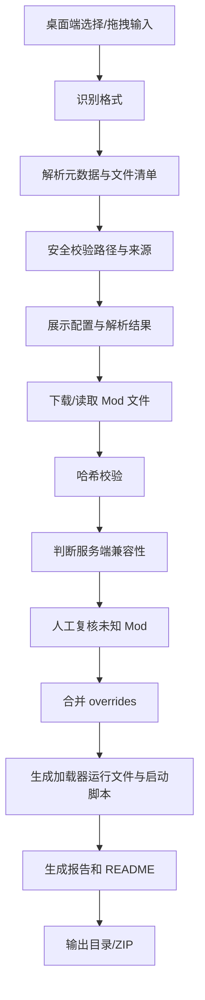

# 我的世界整合包转服务端包工具需求文档

版本：v0.2  
状态：草案  
日期：2026-06-30  

## 1. 背景

Minecraft Java 版整合包通常面向客户端分发，常见格式包括 CurseForge 导出的 `.zip`、Modrinth 的 `.mrpack`、packwiz 管理目录等。服务端部署时需要移除纯客户端 Mod、补齐服务端启动文件、下载清单引用的依赖、合并配置文件，并生成可运行的服务端包。

本工具的目标是把“可被启动器导入的客户端整合包”转换为“可交给服主部署的服务端包”，降低人工筛选 Mod、复制配置、安装加载器和排查依赖缺失的成本。

## 2. 产品定位

产品形态优先级：

1. MVP：桌面程序，提供可视化导入、配置、转换、进度查看、报告查看和服务端包导出能力。
2. P1：命令行接口和批处理能力，适合本地自动化、CI、整合包作者批量发布服务端包。
3. P2：网页版本、规则库远程更新、远程缓存、历史任务、平台发布辅助。

## 3. 目标用户

- 整合包作者：从客户端整合包快速生成服务端包并发布。
- Minecraft 服主：把第三方整合包转换成自己能部署的服务端目录。
- 运维/面板集成方：在流水线或服务器面板中自动化生成服务端包。

## 4. 术语

- 整合包：包含 Mod 清单、配置、资源、脚本等内容的 Minecraft 实例包。
- 服务端包：包含服务端需要的 Mod、配置、启动脚本和说明文件的压缩包或目录。
- overrides：整合包中直接覆盖到实例根目录的文件。
- client-only Mod：仅客户端需要或服务端不支持的 Mod，例如渲染、菜单、性能 HUD、按键绑定类 Mod。
- server-compatible Mod：服务端可安装的 Mod，包括双端 Mod 和服务端专用 Mod。

## 5. 目标

- 支持主流整合包输入格式：CurseForge `.zip`、Modrinth `.mrpack`、packwiz 目录。
- 自动下载清单中引用的 Mod 文件，并做哈希校验。
- 自动识别 Minecraft 版本、加载器类型与加载器版本。
- 自动生成服务端目录结构、启动脚本、转换报告和部署说明。
- 尽量自动移除不适合服务端的 Mod，对无法判断的项给出明确报告和人工确认入口。
- 默认不自动接受 Minecraft EULA，由最终部署者手动确认。

## 6. 非目标

- 不破解平台下载限制，不绕过 CurseForge、Modrinth 或作者设置的分发规则。
- 不保证所有整合包转换后都能一次启动；工具要输出诊断信息和建议。
- 不内置商业服务器托管能力。
- MVP 不提供完整账号系统、在线任务队列、网页分享页面或付费能力。
- 不对第三方 Mod 许可证做法律结论，只做可见信息提示和风险标记。

## 7. 支持范围

### 7.1 输入格式

| 格式 | MVP | 说明 |
| --- | --- | --- |
| CurseForge `.zip` | 必须支持 | 识别根目录 `manifest.json` 与 `overrides/`。 |
| Modrinth `.mrpack` | 必须支持 | 识别根目录 `modrinth.index.json`、`overrides/`、`server-overrides/`。 |
| packwiz 目录 | 必须支持 | 识别 `pack.toml` 与 `index.toml`。 |
| 已解压客户端实例目录 | 可选 | 适合用户手动拖入 `.minecraft` 风格目录。 |

### 7.2 加载器

| 加载器 | MVP | 说明 |
| --- | --- | --- |
| Forge | 必须支持 | 生成服务端安装/启动方案。 |
| NeoForge | 必须支持 | 按加载器版本生成服务端安装/启动方案。 |
| Fabric | 必须支持 | 支持服务端 launcher 或 installer CLI 方式。 |
| Quilt | 应支持 | 按 Modrinth/packwiz 依赖信息识别。 |
| Vanilla | 可选 | 没有加载器时只生成基础服务端包。 |

## 8. 功能需求

### FR-001 输入解析

- 工具必须接收本地文件路径或目录路径作为输入。
- 工具必须自动识别输入格式；识别失败时给出具体原因。
- 工具必须校验压缩包路径，禁止 `../`、绝对路径、Windows 盘符路径等逃逸写入。
- 工具必须拒绝明显异常的压缩包，例如展开后超过用户配置上限、文件数量超过上限、单文件大小超过上限。

验收标准：

- 输入合法 `.mrpack`、CurseForge `.zip`、packwiz 目录时能识别格式。
- 构造包含路径穿越文件的压缩包时，转换任务失败且不会写入目标目录外。

### FR-002 元数据提取

- 工具必须提取整合包名称、版本、Minecraft 版本、加载器类型、加载器版本。
- 工具必须保留原始清单文件到转换工作目录或报告中，便于追踪。
- 工具必须在元数据缺失时提示用户补全信息；桌面端通过表单选择或输入，命令行接口可通过 `--minecraft-version`、`--loader`、`--loader-version` 指定。

验收标准：

- 对 Modrinth 包可从 `dependencies` 中提取 `minecraft` 与加载器依赖。
- 对 CurseForge 包可从 `manifest.json` 中提取 Minecraft 与加载器信息。
- 对 packwiz 包可从 `pack.toml` 中提取版本信息。

### FR-003 文件解析与下载

- 工具必须根据输入格式解析 Mod 文件列表。
- CurseForge 文件必须支持通过 CurseForge API 获取文件信息或下载地址，API key 从环境变量或配置文件读取。
- Modrinth 文件必须使用清单中的下载 URL，并校验 `sha1` 或 `sha512`。
- packwiz 文件必须读取 `index.toml` 和 metafile，按声明的 hash format 校验。
- 下载器必须支持重试、超时、进度输出、并发限制和本地缓存。
- 下载失败时必须记录失败文件、来源、错误码和可人工处理建议。

验收标准：

- 网络正常时能下载所有清单引用的文件。
- 任意文件哈希不匹配时任务失败，报告中包含文件名、期望哈希、实际哈希。
- CurseForge API key 缺失时，包含 CurseForge 远程文件的任务进入可诊断失败状态，而不是静默跳过。

### FR-004 服务端 Mod 筛选

- 工具必须给每个 Mod 生成服务端安装决策：`include`、`exclude`、`manual-review`。
- Modrinth 文件存在 `env.server = unsupported` 时必须默认排除。
- 存在 `env.server = required` 或 `optional` 时必须默认保留，并在报告中标注依据。
- 对 Fabric/Quilt Mod，工具应解析 JAR 内 `fabric.mod.json`、`quilt.mod.json` 中的环境字段。
- 对 Forge/NeoForge Mod，工具应解析 `mods.toml`、`neoforge.mods.toml`、旧版 `mcmod.info`，并结合规则库判断。
- 对无法明确判断的 Mod，默认进入 `manual-review`；桌面程序必须提供人工复核界面，允许用户批量包含或排除未知 Mod。
- 用户必须能通过规则文件强制包含或排除指定 Mod。

验收标准：

- 明确 client-only 的 Mod 不进入最终 `mods/`。
- 不确定项不会被无提示地删除。
- 转换报告列出每个 Mod 的最终决策和判断依据。

### FR-005 overrides 合并

- CurseForge 包必须把 `overrides/` 合并到服务端根目录，但要按服务端规则排除明显客户端文件。
- Modrinth 包必须先合并 `overrides/`，再合并 `server-overrides/`，后者覆盖前者。
- Modrinth 包默认忽略 `client-overrides/`。
- 默认排除客户端特有文件或目录：`options.txt`、`servers.dat`、`screenshots/`、`shaderpacks/`、`resourcepacks/`、`config/iris*` 等；用户可通过规则文件覆盖。
- 必须保留服务端常用目录：`config/`、`defaultconfigs/`、`kubejs/`、`scripts/`、`serverconfig/`、`world/datapacks/` 等。

验收标准：

- 同名配置文件在 `server-overrides/` 中存在时，最终结果以 `server-overrides/` 为准。
- 客户端专用 overrides 不会默认进入服务端包。

### FR-006 服务端运行时生成

- 工具必须生成标准服务端目录结构：

```text
serverpack/
  mods/
  config/
  libraries/           # 视加载器而定
  start.sh
  start.bat
  README.md
  conversion-report.json
  eula.txt             # 默认 eula=false 或不生成，不能自动置为 true
```

- 工具必须根据 Minecraft 版本建议 Java 版本，例如旧版本可能需要 Java 8/17，新版本需要 Java 21；具体策略应可配置并在报告中说明。
- 工具必须生成 Windows 与 Linux/macOS 启动脚本。
- 启动脚本必须支持配置最小/最大内存、JVM 参数、是否 `nogui`。
- 工具必须能选择两种输出模式：
  - `package-only`：只打包 Mod 和配置，不预装加载器。
  - `installable-server`：生成或下载加载器服务端所需文件。

验收标准：

- 生成的 `README.md` 能说明如何接受 EULA、如何调整内存、如何启动服务端。
- 启动脚本中不会硬编码开发者本机路径。

### FR-007 输出格式

- 工具必须支持输出目录。
- 工具必须支持输出 `.zip` 服务端包。
- 工具必须支持输出 `conversion-report.json`，包含：
  - 输入包信息
  - 目标 Minecraft/加载器版本
  - 下载文件列表
  - Mod 筛选决策
  - overrides 合并记录
  - 警告与错误
  - 生成时间和工具版本
- 工具应支持输出 `conversion-report.md`，方便人工查看。

验收标准：

- 同一输入在相同配置下生成稳定的报告结构。
- 转换失败时也保留失败报告，除非用户显式关闭。

### FR-008 桌面程序

MVP 必须提供桌面程序作为主要入口。

平台要求：

- MVP 必须至少支持 Windows 10/11。
- 桌面程序必须提供可分发安装包或免安装压缩包。
- macOS/Linux 支持可作为 P1，除非项目确定采用跨平台桌面框架并能稳定打包。

核心界面：

- 首页/任务创建：选择或拖拽输入包，选择输出目录，显示识别出的包类型。
- 转换配置：设置输出模式、是否生成 zip、内存参数、未知 Mod 处理策略、CurseForge API key、缓存目录。
- 解析结果：展示整合包名称、版本、Minecraft 版本、加载器类型、加载器版本、Mod 数量和 overrides 文件数量。
- Mod 复核：展示每个 Mod 的名称、文件名、来源、判断结果、判断依据，允许搜索、筛选、批量包含、批量排除。
- 转换进度：展示当前阶段、下载进度、速度、失败重试、日志摘要和可取消按钮。
- 转换结果：展示成功/失败状态、服务端包路径、zip 路径、报告入口、README 入口和错误建议。
- 设置页：管理默认输出目录、下载并发数、缓存目录、API key、安全限制和日志级别。

交互要求：

- 必须支持点击选择文件/目录。
- 必须支持拖拽 `.zip`、`.mrpack` 或 packwiz 目录到窗口。
- 必须在转换开始前展示关键配置确认。
- 必须在遇到 `manual-review` Mod 时阻止直接完成转换，除非用户选择统一策略。
- 必须支持取消任务；取消后不能留下半成品输出包。
- 必须支持打开输出目录、打开报告文件、复制错误信息。
- 必须对 API key 做遮蔽显示，并提供清除按钮。
- 必须在离线、下载失败、哈希失败、格式不支持时显示可读错误和下一步建议。

验收标准：

- 用户不打开终端即可完成一次 `.mrpack` 到服务端 zip 的转换。
- 用户能在界面中处理未知 Mod，并在报告中看到自己的决策。
- 转换失败时，界面能打开失败报告并展示失败阶段。
- API key 不会以明文出现在界面日志、报告或输出包中。

### FR-009 命令行接口

命令行接口不作为 MVP 的主入口，但核心转换能力应设计为可被 CLI 调用；若开发成本允许，MVP 可附带实验性 CLI。

命令示例：

```bash
mc-serverpack convert ./modpack.mrpack --out ./dist --zip
mc-serverpack convert ./curseforge-pack.zip --cf-api-key env:CF_API_KEY --unknown manual-review
mc-serverpack convert ./packwiz-pack --mode installable-server --memory 6G
```

必需参数：

- `input`：输入文件或目录。
- `--out`：输出目录。

常用可选参数：

- `--zip`：同时生成 zip。
- `--mode package-only|installable-server`：输出模式。
- `--cf-api-key`：CurseForge API key 来源。
- `--unknown manual-review|include|exclude`：未知 Mod 处理策略。
- `--rules rules.yml`：用户侧筛选/覆盖规则。
- `--cache-dir`：下载缓存目录。
- `--clean`：转换前清理输出目录。
- `--dry-run`：只解析和生成报告，不下载或写服务端包。

### FR-010 规则文件

工具必须支持 YAML 或 JSON 规则文件，用于人工修正判断：

```yaml
mods:
  include:
    - "fabric-api"
    - "kubejs"
  exclude:
    - "modmenu"
    - "sodium-extra"
overrides:
  include:
    - "config/some-server-config.toml"
  exclude:
    - "options.txt"
    - "shaderpacks/**"
```

验收标准：

- 规则文件优先级高于内置规则。
- 规则命中情况写入报告。

### FR-011 日志与错误处理

- 工具必须输出分级日志：`debug`、`info`、`warn`、`error`。
- 桌面程序必须提供日志面板，并允许导出诊断日志。
- 命令行接口可通过 `--verbose` 查看详细日志。
- 所有失败必须有可读错误码，例如 `E_INPUT_FORMAT`、`E_DOWNLOAD_HASH_MISMATCH`、`E_LOADER_UNSUPPORTED`。
- 错误信息必须包含下一步建议。

## 9. 非功能需求

### 9.1 性能

- 对 300 个 Mod、总大小 2GB 以内的整合包，网络稳定时转换流程不应有明显单线程瓶颈。
- 下载并发数默认 4，可配置。
- 本地缓存命中时应跳过重复下载和重复校验。

### 9.2 可靠性

- 中断后再次执行同一任务，应尽量复用缓存并继续。
- 下载失败不应污染最终输出目录；使用临时目录完成后再原子替换或生成。
- 转换报告必须能用于复现问题。

### 9.3 安全

- 解压必须防路径穿越。
- 下载 URL 必须限制协议为 HTTPS，除非用户显式开启不安全源。
- 不执行整合包中的脚本、JAR 或任意可执行文件。
- 不把 API key 写入报告、日志或输出包。
- 临时目录和缓存目录应避免被不同任务互相污染。

### 9.4 合规

- 不默认将 `eula.txt` 设置为 `eula=true`。
- 对无法确认许可证的直接打包 JAR 给出风险提示。
- 对 CurseForge、Modrinth、第三方 URL 的下载行为保留来源记录，方便用户自行核查许可。

### 9.5 可维护性

- 输入格式解析、下载器、筛选规则、加载器安装器应模块化。
- 桌面 UI 与核心转换引擎必须解耦，避免业务逻辑直接写在界面层。
- 内置规则库应可独立更新。
- 核心转换流程应有单元测试和集成测试。

## 10. 转换流程



## 11. MVP 交付范围

MVP 必须完成：

- 桌面程序。
- 文件/目录选择与拖拽导入。
- 可视化转换配置、进度、日志和结果页。
- Mod 人工复核界面。
- 设置页，支持 API key、缓存目录、下载并发数、默认输出目录。
- 支持 CurseForge `.zip`、Modrinth `.mrpack`、packwiz 目录。
- 支持 Forge、NeoForge、Fabric、Quilt 的元数据识别。
- 下载与哈希校验。
- 基础 client-only 筛选规则。
- 用户规则文件。
- 输出目录和 zip。
- `README.md`、`conversion-report.json`。
- 路径安全、API key 脱敏、失败报告。

MVP 可以暂缓：

- 完整命令行接口。
- 在线任务队列。
- 自动启动服务端进行完整验证。
- 许可证自动判定。
- Docker 镜像或面板集成。
- 网页版本。

## 12. 测试需求

### 12.1 单元测试

- CurseForge manifest 解析。
- Modrinth index 解析。
- packwiz `pack.toml`/`index.toml` 解析。
- 路径安全校验。
- 哈希校验。
- Mod 侧别判断。
- overrides 合并优先级。

### 12.2 集成测试

- 使用小型 CurseForge 示例包完成转换。
- 使用小型 Modrinth 示例包完成转换。
- 使用 packwiz 示例目录完成转换。
- 模拟下载失败、哈希失败、未知 Mod。

### 12.3 桌面端测试

- 文件选择导入。
- 拖拽导入。
- 配置项保存与读取。
- manual-review 列表筛选、搜索、批量决策。
- 任务进度展示和取消。
- 转换成功后打开输出目录和报告。
- 转换失败后展示错误码和诊断建议。

### 12.4 回归测试样本

至少维护以下样本：

- Fabric 1.20.1 小包。
- Fabric/Quilt 1.21+ 小包。
- Forge 1.16.5 小包。
- Forge 1.20.1 小包。
- NeoForge 1.21+ 小包。
- 含 `server-overrides` 的 Modrinth 包。
- 含 client-only Mod 的包。
- 含路径穿越攻击样本的恶意包。

## 13. 配置项

| 配置 | 默认值 | 说明 |
| --- | --- | --- |
| `download.concurrent` | `4` | 下载并发数。 |
| `download.timeoutSeconds` | `60` | 单请求超时。 |
| `download.retry` | `3` | 下载失败重试次数。 |
| `security.maxExpandedSize` | `4GB` | 解压后最大总大小。 |
| `security.maxFileCount` | `20000` | 最大文件数量。 |
| `mod.unknownPolicy` | `manual-review` | 未知 Mod 处理策略。 |
| `output.mode` | `package-only` | 默认不预装加载器。 |
| `output.zip` | `false` | 默认只输出目录。 |
| `ui.defaultOutputDir` | 用户文档目录 | 桌面端默认输出目录。 |
| `ui.rememberLastInputDir` | `true` | 是否记住上次导入目录。 |
| `ui.theme` | `system` | 跟随系统主题。 |

## 14. 数据结构草案

```json
{
  "jobId": "string",
  "input": {
    "type": "modrinth|curseforge|packwiz|instance",
    "path": "string",
    "name": "string",
    "version": "string"
  },
  "target": {
    "minecraftVersion": "1.21.1",
    "loader": "fabric",
    "loaderVersion": "0.16.10"
  },
  "mods": [
    {
      "id": "mod-id",
      "fileName": "mod.jar",
      "source": "modrinth|curseforge|direct|local",
      "decision": "include|exclude|manual-review",
      "reason": "env.server=unsupported",
      "hash": {
        "sha1": "..."
      }
    }
  ],
  "warnings": [],
  "errors": []
}
```

## 15. 里程碑

### M1：基础解析与报告

- 搭建桌面程序壳和核心转换引擎边界。
- 完成三类输入格式解析。
- 完成元数据提取。
- 完成桌面端导入、解析结果展示和 `conversion-report.json`。

### M2：下载与输出

- 完成下载器、缓存、哈希校验。
- 完成输出目录和 zip。
- 完成 README 与启动脚本模板。
- 完成桌面端进度页、日志面板、任务取消。

### M3：服务端筛选

- 完成内置规则库。
- 完成 JAR 元数据扫描。
- 完成用户规则文件。
- 完成桌面端 manual-review 复核界面和报告记录。

### M4：加载器服务端生成

- 完成 Fabric/Quilt 服务端生成。
- 完成 Forge/NeoForge 服务端生成。
- 完成常见版本的集成测试。

### M5：可用性与稳定性

- 完善错误码和日志。
- 完成桌面端设置页和失败诊断页。
- 完成恶意压缩包测试。
- 完成缓存和中断恢复。
- 完成桌面程序打包发布。
- 发布 MVP。

## 16. 主要风险

- Mod 侧别信息不完整：很多 Mod 不声明是否支持服务端，需要规则库和人工复核兜底。
- CurseForge 下载限制：需要 API key，部分文件可能无直接下载地址。
- 加载器版本差异：Forge/NeoForge 不同 Minecraft 版本的服务端启动方式存在差异。
- 桌面端打包差异：Windows、macOS、Linux 的文件权限、杀毒误报、路径编码和证书签名要求不同。
- 许可证风险：直接打包第三方 JAR 可能违反作者分发要求。
- 整合包质量差异：用户输入可能缺元数据、重复文件、损坏压缩包或包含客户端私有配置。

## 17. 开放问题

- P1 是否需要发布 macOS/Linux 桌面程序，还是优先保留 Windows 桌面端和命令行接口？
- MVP 是否要求生成可直接启动的服务端，还是只要求生成 Mod/config 包？
- 是否需要内置官方/社区维护的 client-only 规则库更新源？
- 是否要支持从 CurseForge/Modrinth 项目 URL 直接拉取指定版本，而不仅是本地文件？
- 是否需要提供 Docker Compose 输出模板？
- 是否需要在转换后自动执行一次服务端启动预检？

## 18. 参考资料

- CurseForge 支持文档：导出的整合包 zip 根目录包含 `manifest.json` 和 `overrides/`，并要求有效 manifest 与 overrides 结构。<https://support.curseforge.com/support/solutions/articles/9000197908-exporting-a-modpack-for-curseforge-project-submission>
- CurseForge API 文档：可通过 `GET /v1/mods/{modId}/files/{fileId}/download-url` 获取文件下载地址，需 API key。<https://docs.curseforge.com/rest-api/>
- Modrinth `.mrpack` 文档：根目录包含 `modrinth.index.json`，文件项包含下载地址、哈希、环境和依赖信息，并支持 `overrides/`、`server-overrides/`、`client-overrides/`。<https://support.modrinth.com/en/articles/8802351-modrinth-modpack-format-mrpack>
- packwiz 文档：`pack.toml` 定义整合包元数据，`index.toml` 保存文件列表和哈希。<https://packwiz.infra.link/tutorials/creating/getting-started/>
- packwiz `index.toml` 格式：文件路径需在包根目录内，并应防路径穿越。<https://packwiz.infra.link/reference/pack-format/index-toml/>
- Fabric Wiki：Fabric 服务端可通过 server launcher 或 installer CLI 生成，并支持 headless 安装参数。<https://wiki.fabricmc.net/install>
- Minecraft EULA：工具不得替用户默认接受 EULA，应由部署者自行确认。<https://www.minecraft.net/en-us/eula>
